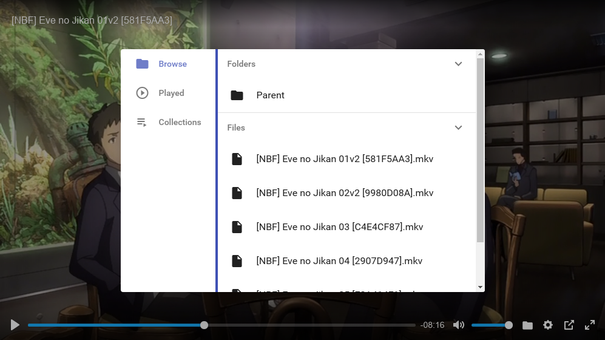

###############
Stream Anywhere
###############

.. image:: https://img.shields.io/travis/Nekmo/stream-anywhere.svg?style=flat-square&maxAge=2592000
  :target: https://travis-ci.org/Nekmo/stream-anywhere
  :alt: Latest Travis CI build status

.. image:: https://img.shields.io/pypi/v/stream-anywhere.svg?style=flat-square
  :target: https://pypi.org/project/stream-anywhere/
  :alt: Latest PyPI version

.. image:: https://img.shields.io/pypi/pyversions/stream-anywhere.svg?style=flat-square
  :target: https://pypi.org/project/stream-anywhere/
  :alt: Python versions

.. image:: https://img.shields.io/codeclimate/maintainability/Nekmo/stream-anywhere.svg?style=flat-square
  :target: https://codeclimate.com/github/Nekmo/stream-anywhere
  :alt: Code Climate

.. image:: https://img.shields.io/codecov/c/github/Nekmo/stream-anywhere/master.svg?style=flat-square
  :target: https://codecov.io/github/Nekmo/stream-anywhere
  :alt: Test coverage

.. image:: https://img.shields.io/requires/github/Nekmo/stream-anywhere.svg?style=flat-square
  :target: https://requires.io/github/Nekmo/stream-anywhere/requirements/?branch=master
  :alt: Requirements Status

Play a video on your pc and continue on your smartphone

Features
========

* Automatically saves the current time in the videos playback to continue later.
* Select videos from your file system and organize them by collections.
* Open the Stream-anywhere url on another device to continue playing.
* Play the next video after finishing the current one.
